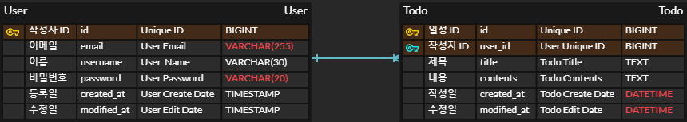
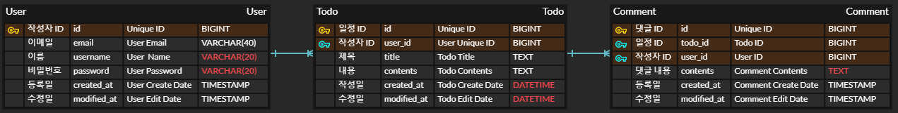

# 일정 관리 앱 Develop

---

## Lv 0. API 명세 및 ERD 작성

### Requirement

- [X] API 명세서 작성
- [X] ERD 작성
- [X] SQL 작성

#### Definition

- [X] API 명세서 작성
    - [X] 할일 API 설계
        - 할일 생성(등록), 전체 할일 조회, 단건 할일 조회, 할일 수정, 할일 삭제

    - [X] 유저 API 설계
        - 유저 생성(등록), 전체 유저 조회, 단건 유저 조회, 유저 수정, 유저 삭제

    - [X] 댓글 API 설계
        - 댓글 생성(등록), 전체 댓글 조회, 단건 댓글 조회, 댓글 수정, 댓글 삭제

- [X] ERD 작성
    - [X] todo
        - [X] id : 할일 아이디 / BIGINT / (PK)
        - [X] user_id : 할일 작성 유저 아이디 / VARCHAR(30) / (FK)
        - [X] title : 할일 제목 / TEXT
        - [X] contents : 할일 내용 / TEXT
        - [X] created_at : 작성일 / DATETIME
        - [X] modified_at : 수정일 / DATETIME

    - [X] user
        - [X] id : 유저 아이디 / BIGINT / (PK)
        - [X] username : 할일 작성 유저 이름 / VARCHAR(30)
        - [X] email : 유저 이메일 / VARCHAR(255)
        - [X] password : 유저 비밀번호 / VARCHAR(20)
        - [X] created_at : 작성일 / DATETIME
        - [X] modified_at : 수정일 / DATETIME

    - [X] comment
        - [X] id : 댓글 아이디 / BIGINT / (PK)
        - [X] user_id : 작성자 유저 아이디 / BIGINT / (FK)
        - [X] todo_id : 할일 아이디 / BIGINT / (FK)
        - [X] contents : 댓글 내용 / TEXT
        - [X] created_at : 작성일 / DATETIME
        - [X] modified_at : 수정일 / DATETIME

- [X] SQL 작성

#### API 명세서

**todo**

|      기능       | HTTP Method |      URL       | Parameters                                     | Request Body                                                                     | Response                                                                                                                                                                     | HTTP Status   |
|:-------------:|-------------|:--------------:|------------------------------------------------|----------------------------------------------------------------------------------|:-----------------------------------------------------------------------------------------------------------------------------------------------------------------------------|---------------|
|   할일 생성(등록)   | **POST**    |    `/todos`    | NONE                                           | { "title" : string, "contents" : string, "email" : String, "password" : string } | { "id" : long, "title" : string, "contents" : string, "email" : string, "username" : string, "createdAt" : string, "updatedAt" : string }                                    | `201 CREATED` |
|   전체 할일 조회    | **GET**     |    `/todos`    | Query : userName(Optional)&userEmail(Optional) | NONE                                                                             | List 형태 { "id" : long, "title" : string, "contents" : string, "email" : string, "username" : string, "comment" : List<Comment>, "createdAt" : string, "updatedAt" : string } | `200 OK`      |
| 전체 할일 조회(페이징) | **GET**     | `/todos/pages` | Query : pageNumber&pageSize                    | NONE                                                                             | Page 형태 { "id" : long, "title" : string, "contents" : string, "email" : string, "username" : string, "comment" : List<Comment>, "createdAt" : string, "updatedAt" : string } | `200 OK`      |
|   단건 할일 조회    | **GET**     | `/todos/{id}`  | Path : id                                      | NONE                                                                             | { "id" : long, "title" : string, "contents" : string, "email" : string, "username" : string, "comment" : List<Comment>, "createdAt" : string, "updatedAt" : string }         | `200 OK`      |
|     할일 수정     | **PUT**     | `/todos/{id}`  | Path : id                                      | { "title" : string, "contents" : string, "email" : string, "password" : string } | { "id" : long, "title" : string, "contents" : string, "email" : string, "username" : string, "createdAt" : string, "updatedAt" : string }                                    | `200 OK`      |
|     할일 삭제     | **DELETE**  | `/todos/{id}`  | Path : id                                      | NONE                                                                             | NONE                                                                                                                                                                         | `200 OK`      |

**user**

|    기능     | HTTP Method |      URL      | Parameters | Request Body                                                   | Response                                                                                                   | HTTP Status   |
|:---------:|-------------|:-------------:|------------|----------------------------------------------------------------|:-----------------------------------------------------------------------------------------------------------|---------------|
| 유저 생성(등록) | **POST**    |   `/users`    | NONE       | { "email" : string, "username" : string, "password" : string } | { "id" : long, "email" : string, "username" : string, "createdAt" : string, "updatedAt" : string }         | `201 CREATED` |
| 전체 유저 조회  | **GET**     |   `/users`    | NONE       | NONE                                                           | List 형태 { "id" : long, "email" : string, "username" : string, "createdAt" : string, "updatedAt" : string } | `200 OK`      |
| 단건 유저 조회  | **GET**     | `/users/{id}` | Path : id  | NONE                                                           | { "id" : long, "email" : string, "username" : string, "createdAt" : string, "updatedAt" : string }         | `200 OK`      |
|   유저 수정   | **PUT**     | `/users/{id}` | Path : id  | { "email" : string, "username" : string, "password" : string } | { "id" : long, "email" : string, "username" : string, "createdAt" : string, "updatedAt" : string }         | `200 OK`      |
|   유저 삭제   | **DELETE**  | `/users/{id}` | Path : id  | NONE                                                           | NONE                                                                                                       | `200 OK`      |

**login**

|  기능   | HTTP Method |      URL       | Parameters | Request Body                              | Response                                                                                                                                                           | HTTP Status |
|:-----:|-------------|:--------------:|------------|-------------------------------------------|:-------------------------------------------------------------------------------------------------------------------------------------------------------------------|-------------|
|  로그인  | **POST**    | `/auth/login`  | NONE       | { "email" : string, "password" : string } | { "id" : long, "email" : string, "username" : string, "sessionId" : string, "getMaxInActiveInterval" : integer, "creationTime" : long, "lastAccessedTime" : long } | `200 OK`    |
| 로그 아웃 | **POST**    | `/auth/logout` | NONE       | { "email" : string }                      | List 형태 { "id" : long, "email" : string, "username" : string }                                                                                                     | `200 OK`    |

**comments**

|    기능     | HTTP Method |       URL        | Parameters                                                      | Request Body                                                  | Response                                                                                                                                            | HTTP Status   |
|:---------:|-------------|:----------------:|-----------------------------------------------------------------|---------------------------------------------------------------|:----------------------------------------------------------------------------------------------------------------------------------------------------|---------------|
| 댓글 생성(등록) | **POST**    |   `/comments`    | NONE                                                            | { "todo_id" : string, "email" : string, "contents" : string } | { "id" : long, "title" : string, "email" : string, "username" : string, "contents" : string, "createdAt" : string, "updatedAt" : string }           | `201 CREATED` |
| 전체 댓글 조회  | **GET**     |   `/comments`    | Query : userName(Optional)&userEmail(Optional)&todoId(Optional) | NONE                                                          | List 형태의  { "id" : long, "title" : string, "email" : string, "username" : string, "contents" : string, "createdAt" : string, "updatedAt" : string } | `200 OK`      |
| 단건 댓글 조회  | **GET**     | `/comments/{id}` | Path : id                                                       | NONE                                                          | { "id" : long, "title" : string, "email" : string, "username" : string, "contents" : string, "createdAt" : string, "updatedAt" : string }           | `200 OK`      |
|   댓글 수정   | **PUT**     | `/comments/{id}` | Path : id                                                       | { "todo_id" : string, "email" : string, "contents" : string } | { "id" : long, "title" : string, "email" : string, "username" : string, "contents" : string, "createdAt" : string, "updatedAt" : string }           | `200 OK`      |
|   댓글 삭제   | **DELETE**  | `/comments/{id}` | Path : id                                                       | NONE                                                          | NONE                                                                                                                                                | `200 OK`      |

#### ERD 작성

**Lv1**


**Lv2,3**



**Lv7**



#### SQL 작성

```mysql
CREATE TABLE user
(
    id          BIGINT AUTO_INCREMENT PRIMARY KEY,
    email       VARCHAR(40) NOT NULL,
    username    VARCHAR(30) NOT NULL,
    password    VARCHAR(20) NOT NULL,
    created_at  DATETIME    NOT NULL,
    modified_at DATETIME    NOT NULL
);

CREATE TABLE todo
(
    id          BIGINT AUTO_INCREMENT PRIMARY KEY,
    user_id     BIGINT   NOT NULL,
    title       TEXT     NOT NULL,
    contents    TEXT     NOT NULL,
    created_at  DATETIME NOT NULL,
    modified_at DATETIME NOT NULL,
    CONSTRAINT fk_user FOREIGN KEY (user_id) REFERENCES user (id)
);

CREATE TABLE comment
(
    id          BIGINT AUTO_INCREMENT PRIMARY KEY,
    todo_id     BIGINT   NOT NULL,
    user_id     BIGINT   NOT NULL,
    contents    TEXT     NOT NULL,
    created_at  DATETIME NOT NULL,
    modified_at DATETIME NOT NULL,
    CONSTRAINT fk_todo FOREIGN KEY (todo_id) REFERENCES todo (id),
    CONSTRAINT fk_user FOREIGN KEY (user_id) REFERENCES user (id)
);
```

---

## Lv 1. 일정 CRUD

### Requirement

- 일정의 생성, 조회, 수정, 삭제 기능 구현
- 일정은 아래 필드를 가짐
    - 작성 유저명
    - 할일 제목
    - 할일 내용
    - 작성일
    - 수정일
        - 작성일, 수정일 필드는 JPA Auditing를 활용

#### Configuration

<details>
<summary></summary>

- [X] 할일 Entity (TimeStamped Auditing)
    - [X] 필드
        - id, username, title, contents

- TimeStamped Entity
    - [X] 필드
        - createdAt, modifiedAt

- [X] 할일 Controller
    - [X] 할일 생성 메서드
        - PostMapping 사용
        - ResponseBody 통해 requestDto 형식 데이터 받음
        - 할일 Service 통해 등록 후 responseDto 형식으로 반환
    - [X] 전체 할일 조회 메서드
        - GetMapping 사용
        - RequestParam을 통해 작성자명 데이터를 가져옴
        - 할일 Service 통해 조건에 맞는 할일을 List로 가져와 responseDto 형식으로 반환
    - [X] 개별 할일 조회 메서드
        - GetMapping 사용
        - PathVariable통해 id 값 가져옴
        - 할일 Service 통해 id값에 맞는 할일 가져와 responseDto 형식으로 반환
    - [X] 개별 할일 수정 메서드
        - PutMapping 사용
        - PathVariable통해 id 값 가져옴
        - ResponseBody 통해 requestDto 형식 데이터 받음
        - 할일 Service 통해 수정 후 수정된 할일 responseDto 형식으로 반환
    - [X] 개별 할일 삭제 메서드
        - DeleteMapping 사용
        - PathVariable통해 id 값 가져옴
        - 할일 Service 통해 id값에 맞는 할일 가져와 삭제

- [X] 할일 RequestDto
    - title, contents, username 사용
- [X] 할일 ResponseDto
    - 전체 데이터 사용

- [X] 할일 Service
    - [X] 할일 저장 메서드
        - 할일 객체 생성
        - 생성한 객체를 사용해 할일 Repository에 저장 요청 후 반환 값 return (responseDto 형식)
    - [X] 전체 할일 조회 메서드
        - 들어온 조건을 사용해 할일 Repository에 할일 조회 요청 후 반환 값 return (responseDto 형식)
    - [X] 특정 할일 조회 메서드
        - 들어온 id값을 사용해 할일 Repository에 할일 조회 요청 후 반환 값 return (responseDto 형식)
    - [X] 할일 수정 메서드
        - 들어온 id값 및 데이터를 활용해 Respostiroy에 할일 수정 요청 후 반환 값 return (responseDto 형식)
    - [X] 할일 삭제 메서드
        - 들어온 id값 활용해 Respostiroy에 할일 삭제 요청

- [X] 할일 Repository
    - [X] findByIdOrElseThrow
        - id값 통해 할일 데이터 찾음
            - 만약 null일 경우 throw 통해 NOT_FOUND 응답
    - [X] findTodosByUsername
        - 유저 이름 통해 할일 리스트 찾음

</details>
___

## Lv 2,3. 유저 CRUD 및 회원 가입

### Requirement

- 유저의 생성, 조회, 수정, 삭제 기능 구현
- 유저는 아래 필드를 가짐
    - 유저명
    - 이메일
    - 비밀번호
    - 작성일
    - 수정일
        - 작성일, 수정일 필드는 JPA Auditing를 활용

- 할일은 이제 작성 유저명 필드 대신 유저 고유 식별자 필드를 가짐

#### Configuration

<details>
<summary></summary>
- [X] 유저 Entity (TimeStamped Auditing)
    - [X] 필드
        - Long id
        - String email
        - String username
        - String password

- [X] 유저 SaveRequestDto
    - email, username, password 사용
- [X] 유저 UpdateRequestDto
    - username, password 사용
- [X] 유저 ResponseDto
    - id, email, username, createdAt, modifiedAt 사용

- [X] 유저 Controller
    - [X] 유저 생성 메서드
        - PostMapping 사용
        - ResponseBody 통해 requestDto 형식 데이터 받음
        - 유저 Service 통해 등록 후 responseDto 형식으로 반환
    - [X] 전체 유저 조회 메서드
        - GetMapping 사용
        - 유저 Service 통해 유저 List로 가져와 responseDto 형식으로 반환
    - [X] 개별 유저 조회 메서드
        - GetMapping 사용
        - PathVariable통해 id 값 가져옴
        - 유저 Service 통해 id값에 맞는 유저 가져와 responseDto 형식으로 반환
    - [X] 개별 유저 수정 메서드
        - PutMapping 사용
        - PathVariable통해 id 값 가져옴
        - ResponseBody 통해 requestDto 형식 데이터 받음
        - 유저 Service 통해 수정 후 수정된 유저 responseDto 형식으로 반환
    - [X] 개별 유저 삭제 메서드
        - DeleteMapping 사용
        - PathVariable통해 id 값 가져옴
        - 유저 Service 통해 id값에 맞는 유저 가져와 삭제

- [X] 유저 Service
    - [X] 유저 저장 메서드
        - 유저 객체 생성
        - 생성한 객체를 사용해 유저 Repository에 저장 요청 후 반환 값 return (responseDto 형식)
    - [X] 전체 유저 조회 메서드
        - 들어온 조건을 사용해 유저 Repository에 유저 조회 요청 후 반환 값 return (responseDto 형식)
    - [X] 특정 유저 조회 메서드
        - 들어온 id값을 사용해 유저 Repository에 유저 조회 요청 후 반환 값 return (responseDto 형식)
    - [X] 유저 수정 메서드
        - 들어온 id값 및 데이터를 활용해 Respostiroy에 유저 수정 요청 후 반환 값 return (responseDto 형식)
    - [X] 유저 삭제 메서드
        - 들어온 id값 활용해 Respostiroy에 유저 삭제 요청

- [X] 유저 Repository
    - [X] findByIdOrElseThrow
        - id값 통해 유저 데이터 찾음
            - 만약 null일 경우 throw 통해 NOT_FOUND 응답
    - [X] findUserByEmail
        - 이메일 통해 유저 데이터 찾음
            - 만약 null일 경우 throw 통해 NOT_FOUND 응답

- [X] 할일 Entity 수정
    - [X] 필드
        - Long id
        - User user
        - String title
        - String contents

- [X] 할일 SaveRequestDto 수정
    - email, title, contents 사용
- [X] 할일 UpdateRequestDto 수정
    - title, contents 사용
- [X] 할일 ResponseDto 수정
    - id, email, username, title, contents, createdAt, modifiedAt 사용

- [X] 할일 Controller 수정
    - [X] 할일 생성 메서드
        - requestDto 수정 (username -> email)
    - [X] 전체 할일 조회 메서드
        - RequestParam 데이터 수정 (username -> username & email)
    - [X] 개별 할일 조회 메서드
        - GetMapping 사용
        - PathVariable통해 id 값 가져옴
        - 할일 Service 통해 id값에 맞는 할일 가져와 responseDto 형식으로 반환

- [X] 할일 Service 수정
    - [X] 할일 저장 메서드
        - 입력받은 email 통해 유저 객체 받음
        - 할일 객체 생성
        - 생성한 객체를 사용해 할일 Repository에 저장 요청
        - 반환 값 return (responseDto 형식)
    - [X] 전체 할일 조회 메서드
        - 이메일 또는 유저명이 입력으로 주어짐.
        - 들어온 조건을 사용해 할일 Repository에 할일 조회 요청 후 반환 값 return (responseDto 형식)

</details>
___

## Lv 4. 로그인(인증)

### Requirement

- Cookie/Session을 활용해 로그인 기능을 구현
    - Filter를 활용해 인증 처리
    - @Configuration을 활용해 필터 등록
- 조건
    - 이메일과 비밀번호를 활용해 로그인 기능을 구현
    - 회원가입, 로그인 요청은 인증 처리에서 제외
- 예외 처리
    - 로그인시 이메일과 비밀번호가 일치하지 않을 경우, 401 : UNAUTHORIZED를 반환

#### Configuration

<details>
<summary></summary>
- [X] WebConfig
    - [X] loginFilter()
        - 로그인용 필터 생성

- [X] AuthFilter
    - [X] doFilter()
        - 로그인 필터 로직 수행
            - login, register, logout이 아닐 경우, 로그인 상태 확인
            - 이미 로그인한 상태에서 register가 들어올 경우, BAD_REQUEST 반환

- [X] LoginRequestDto
    - 로그인 요청시의 데이터 담기 위함
    - email, password
- [X] LogoutRequestDto
    - 로그아웃 요청시의 데이터 담기 위함
    - email
- [X] LoginResponseDto
    - 로그인 응답시의 데이터 담기 위함
    - id, email, username, sessionId, 세션 만료 시간, 생성시간, 마지막 접속 시간
- [X] LogoutResponseDto
    - 로그아웃 응답시의 데이터 담기 위함
    - id, email, username

- [X] AuthController
    - [X] 유저 로그인
        - email과 password가 데이터로 들어오면 authService 통해 로그인 성공 여부 반환
    - [X] 유저 로그 아웃
        - email 과 HttpServletRequest가 데이터로 들어오면, authService 통해 로그 아웃 후 로그 아웃 한 유저 데이터 반환

- [X] AuthService
    - [X] 유저 로그인
        - userRepository의 findByEmail 통해 email에 맞는 유저를 가져옴
        - 만약 비밀번호가 일치하지 않는다면, UNAUTHORIZED 에러 보냄
        - 일치한다면, session에 user 데이터를 담음
        - 유저와 세션 정보를 dto를 통해 반환
    - [X] 유저 로그 아웃
        - Email 데이터가 들어오면 먼저 findByEmail을 통해 유저를 찾음
        - HttpServletRequest를 통해 session 정보를 받아옴
        - 만약 session이 null이 아니라면
            - invalidate 시킴
        - null이라면, 로그인 한 상태가 아니므로
            - BAD_REQUEST 출력
        - dto를 통해 유저 정보 반환

</details>
___

## Lv 5. 다양한 예외처리 적용하기

### Requirement

- Validation을 활용해 다양한 예외 처리 적용
- 프로젝트를 분석하고 예외사항 지정

#### Configuration

<details>
<summary></summary>
- Exception
    - [X] CustomExceptionHandler : 직접 만든 에러코드로 Exception 사용하기 위함

    - [X] ErrorCode : 직접 만든 에러코드 저장
        - INTERNAL_SERVER_ERROR(500, "서버 에러입니다. 잠시 후 다시 시도해 주세요.")
        - NOT_LOGIN(401, "로그인 상태가 아닙니다.")
        - ALREADY_LOGIN(401, "이미 로그인한 상태입니다.")
        - NOT_MATCH_PASSWORD(401, "비밀번호가 일치하지 않습니다.")
        - INVALID_USER_UPDATE_TODO(401, "할일은 작성자만 수정 가능합니다.")
        - INVALID_USER_DELETE_TODO(401, "할일은 작성자만 삭제 가능합니다.")
        - NOT_FOUND_TODO(404, "할일이 존재하지 않습니다.")
        - ALREADY_EXIST_USER(400, "해당 이메일을 사용하는 유저가 이미 존재합니다.")
        - PASSWORD_NOT_CORRESPOND_REQUIREMENT(400, "비밀번호가 요구 조건에 부합하지 않습니다.")
        - INVALID_USER_UPDATE_USER(401, "유저 정보는 본인만 수정 가능합니다.")
        - INVALID_USER_DELETE_USER(401, "유저 정보는 본인만 삭제 가능합니다.")
        - NOT_FOUND_USER(404, "유저가 존재하지 않습니다.")
        - DATA_BAD_REQUEST(400, 해당 에러 넣어 반환)

    - [X] GlobalExceptionHandler : customExcepion 및 serverException 처리하기 위함
        - [X] CustomException 처리 : getStatus, getMessage로 적절히 처리
        - [X] MethodArgumentNotValidException 처리 : 에러 가지고와 DATA_BAD_REQUEST 반환

- AuthFilter
    - [X] URI가 WHILELIST에 포함되어 있지 않고, 세션이 존재하지 않을 경우 : NOT_LOGIN 반환
    - [X] 회원가입시, 이미 로그인 상태로 회원가입을 할 경우 : ALREADY_LOGIN 반환

- LoginRequestDto
    - [X] email : @NotBlank @Email @Size(40)
    - [X] password : @NotBlank @Size(20)

- LogoutRequestDto
    - [X] email : @NotBlank @Email @Size(40)

- AuthService
    - [X] 로그인 시, 입력받은 email에 해당하는 유저의 비밀번호가 입력받은 비밀번호와 일치하지 않을 경우 : NOT_MATCH_PASSWORD 반환
    - [X] 로그아웃 시 , 로그인하지 않은 상태로 로그아웃 시도할 경우 : NOT_LOGIN 반환

- TodoSaveRequestDto
    - [X] email : @NotBlank @Email @Size(40)
    - [X] title : @NotBlank @Size(20)
    - [X] contents : @NotBlank @Size(200)

- TodoUpdateRequestDto
    - [X] title : @NotBlank @Size(20)
    - [X] contents : @NotBlank @Size(200)

- TodoService
    - [X] 수정시 수정할 할일의 작성자와, 요청한 작성자가 같지 않을 경우 : INVALID_USER_UPDATE_TODO 반환
    - [X] 삭제시 삭제할 할일의 작성자와, 요청한 작성자가 같지 않을 경우 : INVALID_USER_DELETE_TODO 반환

- TodoRepository
    - [X] 할일 검색시 해당 할일이 존재 하지 않을 경우 : NOT_FOUND_TODO 반환

- UserSaveRequestDto
    - [X] email : @NotBlank @Email @Size(40)
    - [X] username : @NotBlank @Size(20)
    - [X] password : @NotBlank @Size(20) @Pattern

- UserUpdateRequestDto
    - [X] email : @NotBlank @Email @Size(40)
    - [X] username : @NotBlank @Size(20)
    - [X] password : @NotBlank @Size(20) @Pattern

- UserService
    - [X] : 유저 등록 시, 이미 존재하는 이메일이 있을 경우 : ALREADY_EXIST_USER 반환
    - [X] : 유저 등록 시, 비밀번호가 조건에 일치하지 않을 경우 : PASSWORD_NOT_CORRESPOND_REQUIREMENT
    - [X] : 유저 수정 시, 수정할 유저와 요청한 유저가 같지 않을 경우 : INVALID_USER_UPDATE_USER 반환
    - [X] : 유저 삭제 시, 삭제할 유저와 요청한 유저가 같지 않을 경우 : INVALID_USER_DELETE_USER 반환

- UserRepository
    - [X] : 유저 Id로 검색 시, 해당 유저가 존재하지 않을 경우 : NOT_FOUND_USER 반환
    - [X] : 유저 email로 검색 시, 해당 유저가 존재하지 않을 경우 : NOT_FOUND_USER 반환

</details>
___

## Lv 6. 비밀번호 암호화

### Requirement

- 비밀번호 필드에 들어가는 비밀번호를 암호화
- 암호화를 위한 PasswordEncoder를 직접 만들어 사용

#### Configuration

<details>
<summary></summary>
- [X] PasswordEncoder
    - [X] encode(password)
        - 입력 받은 비밀번호를 암호화 한후 String 타입으로 반환
    - [X] matches(rawPassword, encodedPassword)
        - 입력 받은 비밀번호가 DB에 저장되어 있는 비밀번호와 일치하는 지 확인 후 T or F 반환

- [X] AuthService
    - [X] 로그인 시, 비밀번호가 일치하는지 mathces 사용하여 확인

- [X] UserService
    - [X] 회원가입 시, 비밀번호를 encode 하여 저장

</details>
___

## Lv 7. 댓글 CRUD

### Requirement

- 생성한 TODO에 댓글을 남길 수 있음
    - 댓글과 일정은 연관 관계를 가짐

- 댓글을 저장, 조회, 수정, 삭제 가능
- 댓글은 다음 필드를 가짐
    - 댓글 내용, 작성일, 수정일, 유저 고유 식별자, 일정 고유 식별자
    - 작성일, 수정일은 JPA Auditing 사용

#### Configuration

<details>
<summary></summary>
- Comment
    - [X] Field
        - id
        - contents
        - createdAt
        - modifiedAt
        - Todo (JoinColumn = "todo_id")
        - User (JoinColumn = "user_id")

- CommentSaveRequestDto
    - [X] todo_id : @NotNull
    - [X] email : @NotBlank @Email @Size(40)
    - [X] contents : @NotBlank @Size(50)

- CommentUpdateRequestDto
    - [X] todo_id : @NotNull
    - [X] email : @NotBlank @Email @Size(40)
    - [X] contents : @NotBlank @Size(50)

- CommentResponseDto
    - [X] "id" : long
    - [X] "title" : string
    - [X] "email" : string
    - [X] "username" : string
    - [X] "contents" : string
    - [X] "createdAt" : string
    - [X] "updatedAt" : string

- 댓글 Controller
    - [X] 댓글 생성 메서드
        - PostMapping 사용
        - ResponseBody 통해 requestDto 형식 데이터 받음
        - 댓글 Service 통해 등록 후 responseDto 형식으로 반환
    - [X] 전체 댓글 조회 메서드
        - GetMapping 사용
        - RequestParam을 통해 작성자명 또는 작성자 이메일 데이터 또는 할일 id값 가져옴
        - 댓글 Service 통해 조건에 맞는 댓글을 List로 가져와 responseDto 형식으로 반환
    - [X] 개별 댓글 조회 메서드
        - GetMapping 사용
        - PathVariable통해 id 값 가져옴
        - 댓글 Service 통해 id값에 맞는 댓글 가져와 responseDto 형식으로 반환
    - [X] 개별 댓글 수정 메서드
        - PutMapping 사용
        - PathVariable통해 id 값 가져옴
        - ResponseBody 통해 requestDto 형식 데이터 받음
        - 댓글 Service 통해 수정 후 수정된 댓글 responseDto 형식으로 반환
    - [X] 개별 댓글 삭제 메서드
        - DeleteMapping 사용
        - PathVariable통해 id 값 가져옴
        - 댓글 Service 통해 id값에 맞는 댓글 가져와 삭제

- 댓글 Service
    - [X] 댓글 저장 메서드
        - 댓글 객체 생성
        - 이메일과 댓글을 작성할 할일 존재하는지 검사
        - 생성한 객체를 사용해 댓글 Repository에 저장 요청 후 반환 값 return (responseDto 형식)
    - [X] 전체 댓글 조회 메서드
        - 들어온 조건을 사용해 댓글 Repository에 댓글 조회 요청 후 반환 값 return (responseDto 형식)
    - [X] 개별 댓글 조회 메서드
        - 들어온 id값을 사용해 댓글 Repository에 댓글 조회 요청 후 반환 값 return (responseDto 형식)
    - [X] 댓글 수정 메서드
        - 댓글 작성자와 댓글 수정 요청자가 일치하는 지 검사
        - 들어온 id값 및 데이터를 활용해 Repository에 댓글 수정 요청 후 반환 값 return (responseDto 형식)
    - [X] 댓글 삭제 메서드
        - 댓글 작성자와 댓글 삭제 요청자가 일치하는 지 검사
        - 들어온 id값 활용해 Repository에 댓글 삭제 요청

- 댓글 Repository
    - [X] findByIdOrElseThrow
        - id값 통해 댓글 데이터 찾음
            - 만약 null일 경우 throw 통해 NOT_FOUND 응답
    - [X] findByFilters
        - 유저 이름 또는 유저 이메일 또는 할일 ID를 사용하여 해당 데이터에 맞는 댓글만 찾아 반환
    - [X] findByTodoId
        - TodoId 값 통해 특정 할일에 대한 댓글 데이터를 찾음

- TodoFindResponseDto
    - "id" : long
    - "title" : string
    - "contents" : string
    - "email" : string
    - "username" : string
    - "comment" : List<Comment>
    - "createdAt" : string
    - "updatedAt" : string

- Todo Service 수정
    - [X] 전체 할일 조회 메서드
        - 유저 이름 또는 유저 이메일 값이 들어옴
        - 들어온 조건을 사용해 할일 Repository에 할일 조회 요청 후 반환 값 return (responseDto 형식)
            - 각 할일의 댓글들도 조회하여 dto에 List형식으로 추가 후 return
    - [X] 특정 할일 조회 메서드
        - 들어온 id값을 사용해 할일 Repository에 할일 조회 요청 후 반환 값 return (responseDto 형식)
            - 각 할일의 댓글들도 조회하여 dto에 List형식으로 추가 후 return

</details>
___

## Lv 8. 일정 페이징 조회

### Requirement

- 일정을 Spring Data JPA의 Pageable과 Page 인터페이스를 활용하여 페이지네이션을 구현
    - 페이지 번호와 페이지 크기를 쿼리 파라미터로 전달하여 요청하는 항목을 나타냄
    - 할일 제목, 할일 내용, 댓글 개수, 일정 작성일, 일정 수정일, 일정 작성 유저명 필드를 조회
    - default 페이지 크기는 10
    - 일정의 수정일을 기준으로 내림차순 정렬

#### Configuration

<details>
<summary></summary>
- [X] TodoPageResponseDto
    - title
    - contents
    - username
    - commentsCount
    - createdAt
    - modifiedAt

- Todo Controller 수정
    - [X] 전체 할일 조회(페이징) 메서드 구현
        - GetMapping 사용
        - 쿼리 파라미터를 통해 페이지 번호와 페이지 크기를 가져옴
            - default 페이지 번호 : 0
            - default 페이지 크기 : 10
        - 할일 Service 통해 조건에 맞는 할일을 Page로 가져와 responseDto 형식으로 반환

- Todo Service 수정
    - [X] 전체 할일 조회 메서드
        - 들어온 조건을 사용해 할일 Repository에 할일 조회 요청 후 반환 값 return (responseDto 형식)

</details>
___

## V1. 리팩토링

### Requirement

- DTO 최적화
    - Save와 Update가 같은 데이터를 가지므로 하나로 합쳐 구현
- 순환 참조 해결
    - CommentService와 TodoService의 순환 참조를 해결
        - CommentService에서 findTodoById만 사용하므로 해당 메서드만 따로 분리하여 CommentServiceForTodo 생성
- static factory method 사용
    - responseDto 사용시 new ResponseDto 사용보다는, static 메서드 생성하여 사용 권장
    - responseDto의 생성자는 private로 관리

#### Configuration

- DTO 최적화
    - [X] SaveResponseDto와 UpdateResponseDto 하나로 합침
- CommentServiceForTodo
    - [X] findByTodoId를 해당 서비스에 구현 후 TodoService에서는 해당 서비스 적용
- static factory method
    - [X] responseDto 사용시 new ResponseDto 사용보다는, static 메서드 생성하여 사용 권장
    - [X] responseDto의 생성자는 private로 관리

___

## V2. 리팩토링

### Requirement

- Page pageNumber, pageSize가 아닌 Pageable 객체로 받도록 수정
- FetchType LAZY로 설정
- 업데이트이후 바로 dto 반환 시 수정 시간이 업데이트 되지 않는 문제 해결

#### Configuration

- [X] TodoController 및 TodoService에서 Page pageNumber, pageSize가 아닌 Pageable 객체로 받도록 수정
- [X] FetchType LAZY로 설정
- [X] 업데이트이후 바로 dto 반환 시 수정 시간이 업데이트 되지 않는 문제 해결

___

## V3. 리팩토링

### Requirement

- [X] 디렉토리 구조 3 Layered Architecture로 변경
- [X] 리포지토리의 default 제거 하여 validation을 온전히 Service에서 처리
- [X] @Transactional 사용할곳만 사용
- [X] README.md 정리 및 리팩토링
- [X] dto에는 꼭 필요한 정보만 넣기
- [ ] Service에서 dto 객체를 직접 return이 아닌 Controller에 객체를 return하고 Controller에서 dto로 변환

___

## Commit Convention

### 형식

```
type(scope) : short summary

[body]

[footer]
```

<br>type : 커밋의 목적
<br>scope : 변경된 코드의 범위
<br>short summary : 커밋의 간략한 설명
<br>body : 커밋의 자세한 설명
<br>footer : 부가 정보

### type

<br>feat: 새로운 기능 추가.
<br>impl: 기능 수정.
<br>fix: 버그 수정.
<br>docs: 문서 수정 (README.md, 주석 등).
<br>style: 코드 포맷팅, 세미콜론 누락 등 기능에 영향을 미치지 않는 변경.
<br>refactor: 코드 리팩토링 (기능 변화 없음).
<br>test: 테스트 코드 추가/수정.
<br>chore: 빌드 프로세스 또는 패키지 매니저 설정 수정.
<br>perf: 성능 개선을 위한 변경.
<br>ci: CI 설정 변경.
<br>build: 빌드 관련 파일 변경.

#### Type Emoji

✨ : feat
<br>🐛 : fix
<br>📝 : docs
<br>🎨 : style
<br>🔨 : refactor
<br>🚀 : perf
<br>✅ : test
<br>📦 : chore
<br>🗑️ : delete
---

## Code Convention

<br>class name : PascalCase(ex: MyClass)
<br>method and var : camelCase(ex: userName)
<br>const : UPPER_SNAKE_CASE(ex: MAX_LENGTH)

class : 명사형
<br>interface : 형용사 or 명사형
<br>method : 동사형
<br>var : 명사형, 의미 알수 있도록 명확히
<br>들여 쓰기 : 4칸
<br>중괄호 : 한 줄 아래에서 시작
<br>공백 : 연산자, 피연산자 사이에 공백 사용 ex : total = price + tax; / calculateTotal(price, tax);

주석 : 가능하면 JavaDoc 형식 사용

코드 : 클래스 내부 코드는 const, field, constructor, method 순으로 작성

---