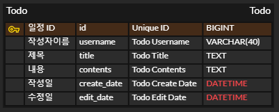

# 일정 관리 앱 Develop

---

## Lv 0. API 명세 및 ERD 작성

### Requirement

- [X] API 명세서 작성
- [X] ERD 작성
- [X] SQL 작성

#### Definition

- [X] API 명세서 작성
    - [X] 할일 API 설계
        - [X] 할일 생성(등록)
        - [X] 전체 할일 조회
        - [X] 단건 할일 조회
        - [X] 할일 수정
        - [X] 할일 삭제

    - [X] 유저 API 설계
        - [X] 유저 생성(등록)
        - [X] 전체 유저 조회
        - [X] 단건 유저 조회
        - [X] 유저 수정
        - [X] 유저 삭제

- [X] ERD 작성
    - [X] todo
        - [X] id : 할일 아이디 / BIGINT / (PK)
        - [X] user_id : 할일 작성 유저 아이디 / VARCHAR(30) / (FK)
        - [X] title : 할일 제목 / TEXT
        - [X] contents : 할일 내용 / TEXT
        - [X] created_at : 작성일 / DATETIME
        - [X] modified_at : 수정일 / DATETIME

    - [X] user
        - [X] id : 유저 아이디 / BIGINT / (PK)
        - [X] username : 할일 작성 유저 이름 / VARCHAR(30)
        - [X] email : 유저 이메일 / VARCHAR(255)
        - [X] password : 유저 비밀번호 / VARCHAR(20)
        - [X] created_at : 작성일 / DATETIME
        - [X] modified_at : 수정일 / DATETIME

- [X] SQL 작성

#### API 명세서

**todo**

|    기능     | HTTP Method |      URL      | Parameters                                  | Request Body                                                                  | Response                                                                                                                                     | HTTP Status   |
|:---------:|-------------|:-------------:|---------------------------------------------|-------------------------------------------------------------------------------|:---------------------------------------------------------------------------------------------------------------------------------------------|---------------|
| 할일 생성(등록) | **POST**    |   `/todos`    | NONE                                        | { "title": string, "contents": string, "email" : String, "password": string } | { "id": long, "title": string, "contents": string, "email" : string, "username" : string, "createdAt": string, "updatedAt": string }         | `201 CREATED` |
| 전체 할일 조회  | **GET**     |   `/todos`    | Query : userName(Optional)&userId(Optional) | NONE                                                                          | List 형태 { "id": long, "title": string, "contents": string, "email" : string, "username" : string, "createdAt": string, "updatedAt": string } | `200 OK`      |
| 단건 할일 조회  | **GET**     | `/todos/{id}` | Path : id                                   | NONE                                                                          | { "id": long, "title": string, "contents": string, "email" : string, "username" : string, "createdAt": string, "updatedAt": string }         | `200 OK`      |
|   할일 수정   | **PUT**     | `/todos/{id}` | Path : id                                   | { "title": string, "contents": string, "email" : string, "password": string } | { "id": long, "title": string, "contents": string, "email" : string, "username" : string, "createdAt": string, "updatedAt": string }         | `200 OK`      |
|   할일 삭제   | **DELETE**  | `/todos/{id}` | Path : id                                   | NONE                                                                          | NONE                                                                                                                                         | `200 OK`      |

**user**

|    기능     | HTTP Method |      URL      | Parameters | Request Body                                                | Response                                                                                              | HTTP Status   |
|:---------:|-------------|:-------------:|------------|-------------------------------------------------------------|:------------------------------------------------------------------------------------------------------|---------------|
| 유저 생성(등록) | **POST**    |   `/users`    | NONE       | { "email": string, "username": string, "password": string } | { "id": long, "email": string, "username": string, "createdAt": string, "updatedAt": string }         | `201 CREATED` |
| 전체 유저 조회  | **GET**     |   `/users`    | NONE       | NONE                                                        | List 형태 { "id": long, "email": string, "username": string, "createdAt": string, "updatedAt": string } | `200 OK`      |
| 단건 유저 조회  | **GET**     | `/users/{id}` | Path : id  | NONE                                                        | { "id": long, "email": string, "username": string, "createdAt": string, "updatedAt": string }         | `200 OK`      |
|   유저 수정   | **PUT**     | `/users/{id}` | Path : id  | { "email": string, "username": string, "password": string } | { "id": long, "email": string, "username": string, "createdAt": string, "updatedAt": string }         | `200 OK`      |
|   유저 삭제   | **DELETE**  | `/users/{id}` | Path : id  | NONE                                                        | NONE                                                                                                  | `200 OK`      |

#### ERD 작성

**Lv1**



**Lv2,3**


#### SQL 작성

```mysql
CREATE TABLE user
(
    id          BIGINT AUTO_INCREMENT PRIMARY KEY,
    email       VARCHAR(255) NOT NULL,
    username        VARCHAR(30)  NOT NULL,
    password    VARCHAR(20)  NOT NULL,
    created_at  DATETIME     NOT NULL,
    modified_at DATETIME     NOT NULL
);

CREATE TABLE todo
(
    id          BIGINT AUTO_INCREMENT PRIMARY KEY,
    user_id     BIGINT   NOT NULL,
    title       TEXT     NOT NULL,
    contents    TEXT     NOT NULL,
    created_at  DATETIME NOT NULL,
    modified_at DATETIME NOT NULL,
    CONSTRAINT fk_user FOREIGN KEY (user_id) REFERENCES user (id)
);
```

---

## Lv 1. 일정 CRUD

### Requirement

- 일정의 생성, 조회, 수정, 삭제 기능 구현
- 일정은 아래 필드를 가짐
    - 작성 유저명
    - 할일 제목
    - 할일 내용
    - 작성일
    - 수정일
        - 작성일, 수정일 필드는 JPA Auditing를 활용

#### Configuration

- [X] 할일 Entity (TimeStamped Auditing)
    - [X] 필드[
        - id
        - username
        - title
        - contents

- TimeStamped Entity
    - [X] 필드
        - createdAt
        - modifiedAt

- [X] 할일 Controller
    - [X] 할일 생성 메서드
        - PostMapping 사용
        - ResponseBody 통해 requestDto 형식 데이터 받음
        - 할일 Service 통해 등록 후 responseDto 형식으로 반환
    - [X] 전체 할일 조회 메서드
        - GetMapping 사용
        - RequestParam을 통해 작성자명 데이터를 가져옴
        - 할일 Service 통해 조건에 맞는 할일을 List로 가져와 responseDto 형식으로 반환
    - [X] 개별 할일 조회 메서드
        - GetMapping 사용
        - PathVariable통해 id 값 가져옴
        - 할일 Service 통해 id값에 맞는 할일 가져와 responseDto 형식으로 반환
    - [X] 개별 할일 수정 메서드
        - PutMapping 사용
        - PathVariable통해 id 값 가져옴
        - ResponseBody 통해 requestDto 형식 데이터 받음
        - 할일 Service 통해 수정 후 수정된 할일 responseDto 형식으로 반환
    - [X] 개별 할일 삭제 메서드
        - DeleteMapping 사용
        - PathVariable통해 id 값 가져옴
        - 할일 Service 통해 id값에 맞는 할일 가져와 삭제

- [X] 할일 RequestDto
    - title, contents, username 사용
- [X] 할일 ResponseDto
    - 전체 데이터 사용

- [X] 할일 Service
    - [X] 할일 저장 메서드
        - 할일 객체 생성
        - 생성한 객체를 사용해 할일 Repository에 저장 요청 후 반환 값 return (responseDto 형식)
    - [X] 전체 할일 조회 메서드
        - 들어온 조건을 사용해 할일 Repository에 할일 조회 요청 후 반환 값 return (responseDto 형식)
    - [X] 특정 할일 조회 메서드
        - 들어온 id값을 사용해 할일 Repository에 할일 조회 요청 후 반환 값 return (responseDto 형식)
    - [X] 할일 수정 메서드
        - 들어온 id값 및 데이터를 활용해 Respostiroy에 할일 수정 요청 후 반환 값 return (responseDto 형식)
    - [X] 할일 삭제 메서드
        - 들어온 id값 활용해 Respostiroy에 할일 삭제 요청

- [X] 할일 Repository
    - [X] findByIdOrElseThrow
        - id값 통해 할일 데이터 찾음
            - 만약 null일 경우 throw 통해 NOT_FOUND 응답
    - [X] findTodosByUsername
        - 유저 이름 통해 할일 리스트 찾음

___

## Lv 2,3. 유저 CRUD 및 회원 가입

### Requirement

- 유저의 생성, 조회, 수정, 삭제 기능 구현
- 유저는 아래 필드를 가짐
    - 유저명
    - 이메일
    - 비밀번호
    - 작성일
    - 수정일
        - 작성일, 수정일 필드는 JPA Auditing를 활용

- 할일은 이제 작성 유저명 필드 대신 유저 고유 식별자 필드를 가짐

#### Configuration

- [X] 유저 Entity (TimeStamped Auditing)
    - [X] 필드
        - Long id
        - String email
        - String username
        - String password

- [X] 유저 SaveRequestDto
    - email, username, password 사용
- [X] 유저 UpdateRequestDto
    - username, password 사용
- [X] 유저 ResponseDto
    - id, email, username, createdAt, modifiedAt 사용

- [X] 유저 Controller
    - [X] 유저 생성 메서드
        - PostMapping 사용
        - ResponseBody 통해 requestDto 형식 데이터 받음
        - 유저 Service 통해 등록 후 responseDto 형식으로 반환
    - [X] 전체 유저 조회 메서드
        - GetMapping 사용
        - 유저 Service 통해 유저 List로 가져와 responseDto 형식으로 반환
    - [X] 개별 유저 조회 메서드
        - GetMapping 사용
        - PathVariable통해 id 값 가져옴
        - 유저 Service 통해 id값에 맞는 유저 가져와 responseDto 형식으로 반환
    - [X] 개별 유저 수정 메서드
        - PutMapping 사용
        - PathVariable통해 id 값 가져옴
        - ResponseBody 통해 requestDto 형식 데이터 받음
        - 유저 Service 통해 수정 후 수정된 유저 responseDto 형식으로 반환
    - [X] 개별 유저 삭제 메서드
        - DeleteMapping 사용
        - PathVariable통해 id 값 가져옴
        - 유저 Service 통해 id값에 맞는 유저 가져와 삭제

- [X] 유저 Service
    - [X] 유저 저장 메서드
        - 유저 객체 생성
        - 생성한 객체를 사용해 유저 Repository에 저장 요청 후 반환 값 return (responseDto 형식)
    - [X] 전체 유저 조회 메서드
        - 들어온 조건을 사용해 유저 Repository에 유저 조회 요청 후 반환 값 return (responseDto 형식)
    - [X] 특정 유저 조회 메서드
        - 들어온 id값을 사용해 유저 Repository에 유저 조회 요청 후 반환 값 return (responseDto 형식)
    - [X] 유저 수정 메서드
        - 들어온 id값 및 데이터를 활용해 Respostiroy에 유저 수정 요청 후 반환 값 return (responseDto 형식)
    - [X] 유저 삭제 메서드
        - 들어온 id값 활용해 Respostiroy에 유저 삭제 요청

- [X] 유저 Repository
    - [X] findByIdOrElseThrow
        - id값 통해 유저 데이터 찾음
            - 만약 null일 경우 throw 통해 NOT_FOUND 응답
    - [X] findUserByEmail
        - 이메일 통해 유저 데이터 찾음
            - 만약 null일 경우 throw 통해 NOT_FOUND 응답

- [X] 할일 Entity 수정
    - [X] 필드
        - Long id
        - User user
        - String title
        - String contents

- [X] 할일 SaveRequestDto 수정
    - email, title, contents 사용
- [X] 할일 UpdateRequestDto 수정
    - title, contents 사용
- [X] 할일 ResponseDto 수정
    - id, email, username, title, contents, createdAt, modifiedAt 사용

- [X] 할일 Controller 수정
    - [X] 할일 생성 메서드
        - requestDto 수정 (username -> email)
    - [X] 전체 할일 조회 메서드
        - RequestParam 데이터 수정 (username -> username & email)
    - [X] 개별 할일 조회 메서드
        - GetMapping 사용
        - PathVariable통해 id 값 가져옴
        - 할일 Service 통해 id값에 맞는 할일 가져와 responseDto 형식으로 반환

- [X] 할일 Service 수정
    - [X] 할일 저장 메서드
        - 입력받은 email 통해 유저 객체 받음
        - 할일 객체 생성
        - 생성한 객체를 사용해 할일 Repository에 저장 요청
        - 반환 값 return (responseDto 형식)
    - [X] 전체 할일 조회 메서드
        - 이메일 또는 유저명이 입력으로 주어짐.
        - 들어온 조건을 사용해 할일 Repository에 할일 조회 요청 후 반환 값 return (responseDto 형식)
___

## Commit Convention

### 형식

```
type(scope) : short summary

[body]

[footer]
```

<br>type : 커밋의 목적
<br>scope : 변경된 코드의 범위
<br>short summary : 커밋의 간략한 설명
<br>body : 커밋의 자세한 설명
<br>footer : 부가 정보

### type

<br>feat: 새로운 기능 추가.
<br>impl: 기능 수정.
<br>fix: 버그 수정.
<br>docs: 문서 수정 (README.md, 주석 등).
<br>style: 코드 포맷팅, 세미콜론 누락 등 기능에 영향을 미치지 않는 변경.
<br>refactor: 코드 리팩토링 (기능 변화 없음).
<br>test: 테스트 코드 추가/수정.
<br>chore: 빌드 프로세스 또는 패키지 매니저 설정 수정.
<br>perf: 성능 개선을 위한 변경.
<br>ci: CI 설정 변경.
<br>build: 빌드 관련 파일 변경.

#### Type Emoji

✨ : feat
<br>🐛 : fix
<br>📝 : docs
<br>🎨 : style
<br>🔨 : refactor
<br>🚀 : perf
<br>✅ : test
<br>📦 : chore
<br>🗑️ : delete
---

## Code Convention

<br>class name : PascalCase(ex: MyClass)
<br>method and var : camelCase(ex: userName)
<br>const : UPPER_SNAKE_CASE(ex: MAX_LENGTH)

class : 명사형
<br>interface : 형용사 or 명사형
<br>method : 동사형
<br>var : 명사형, 의미 알수 있도록 명확히
<br>들여 쓰기 : 4칸
<br>중괄호 : 한 줄 아래에서 시작
<br>공백 : 연산자, 피연산자 사이에 공백 사용 ex : total = price + tax; / calculateTotal(price, tax);

주석 : 가능하면 JavaDoc 형식 사용

코드 : 클래스 내부 코드는 const, field, constructor, method 순으로 작성

---